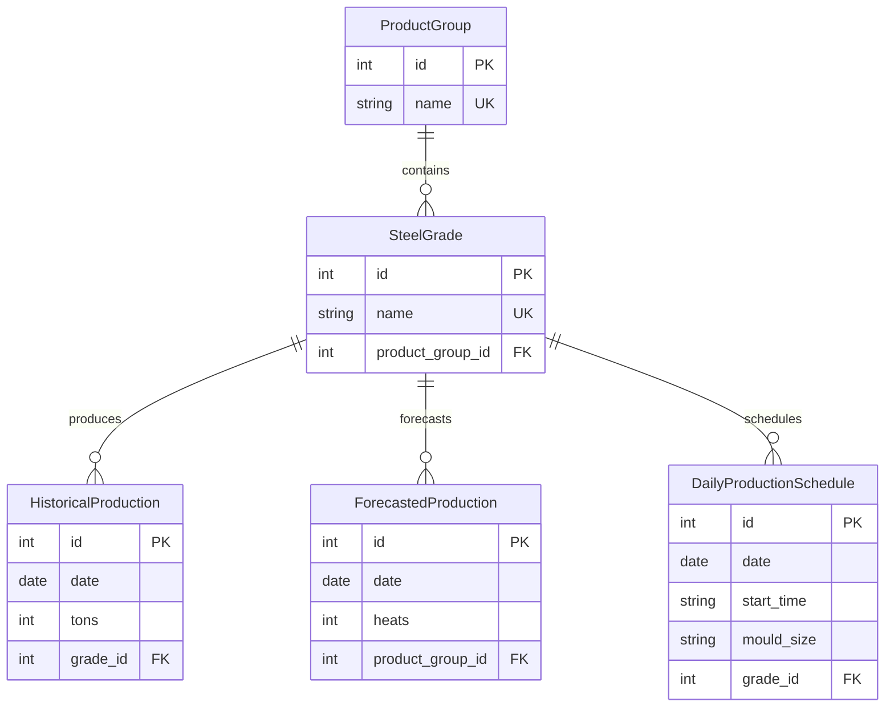

# FDM-CHALLENGE

This repository implements an API and database schema for a steel plant's production plans.

## Repository Structure

```
FDM-CHALLENGE/
│
├── app/                     # Main application code
│   ├── __init__.py
│   ├── main.py              # FastAPI app entry point
│   ├── crud.py              # Database operations
│   ├── database.py          # Database connection setup
│   │         
│   └── models/              # Data models
│   │   ├── pydantic.py      # API request/response models
│   │   └── schema.py        # SQLAlchemy database models
│   │             
│   └── api/                 # API routes
│       ├── __init__.py
│       └── routes.py        # Endpoint definitions
│
├── data/                    # Sample data files
│   ├── daily_charge_schedule.xlsx
│   ├── product_groups_monthly.xlsx
│   ├── steel_grade_production.xlsx
│   └── /processed           # Processed data output
│
├── tests/                   # Unit tests
│   ├── __init__.py
│   └── test_api.py          # API endpoint tests
│
├── utility/                 # Helper functions
│   ├── preprocess.py        # Data preprocessing
│   └── linear_fit.py        # Confirming given forecast
│
├── .github/workflows        # CI/CD automation for black
├── docker-compose.yml       # Container orchestration
├── Dockerfile               # Container build instructions
├── init.sql                 # Database schema setup
├── README.md                # Project documentation
├── forecast_logic.ipynb     # Linear plots for steel_grade_production
├── requirements.txt         # Python dependencies
├── uv.lock                  # Deterministic env
└── pyproject.toml
```

## Project Highlights

### **Production-Ready Steel Plant API**
- **FastAPI + PostgreSQL**: Modern, high-performance API with robust database integration
- **Dockerized Deployment**: One-command setup with `docker-compose up --build`
- **Interactive Documentation**: Auto-generated OpenAPI docs at `/docs` for easy API exploration
- **Forecasting Endpoint**: User-defined steel grades and weights (see Forecasting Endpoint section)

### **Robust Data Processing Pipeline**
- **Multi-Format Data Ingestion**: Seamlessly processes non-tabular data and Excel (.xlsx, .xls) and CSV files
- **Data Validation**: Pydantic models ensure data integrity throughout the pipeline
- **DB Indexed**: Index added for faster queries

### **API Design**
- **Modular Design**
- **Comprehensive CRUD Operations**
- **Scalable Schema**

### **Quality Assurance**
- **Automated Testing**: pytest-based test suite
- **CI/CD Pipeline**: GitHub Actions ensuring code quality with Black formatting

## Forecasting Endpoint

Firstly, I validated that the forecast on ```product_groups_monthly.xlsx``` accurately matches the production history by running a set of linear regressions presented in ```forecast_logic.ipynb```. For every product group the correlation coefficient is near-perfect $R \approx 1$ so the forecast already given doesn't need to be adjusted.

I decide the forecast endpoint should already receive from the user the Grades specified and the percentage of the heats of the Group that Grade should correspond to for the following reasons:

1) The uncertainty | mean - max deviation| is too large: check ```forecast_logic.ipynb```

2) Data sparsity: the data is sparse which means many Grades should be set to zero

3) Business logic: the Grades to produce shouldn't be predicted but instead given by the user since it depends on the scrap material available, budget and goals of the factory

## Running the API

### Using Docker (Recommended)

The easiest way to run the project is using Docker, which automatically sets up both the application and PostgreSQL database. Assuming docker and docker compose have been installed on your system, the project can be set up with a single line:

```bash
docker-compose up --build
```

### Locally (Alternative Setup)

Here I detail the local setup using uv. This could also be done alternatively with python virtual environments. The file ```requirements.txt``` was left in this repository to allow the user to reproduce the results locally (and without uv).

#### Install uv (if not already installed)
```bash
# On macOS/Linux
curl -LsSf https://astral.sh/uv/install.sh | sh

# On Windows
powershell -c "irm https://astral.sh/uv/install.ps1 | iex"

# Or with pip
pip install uv
```

#### Install dependencies with uv
```bash
# Install all dependencies (including dev dependencies)
uv sync --all-extras

# Or install only production dependencies
uv sync
```

#### Run the application
```bash
# Run with uv (recommended)
uv run uvicorn app.main:app --reload --host 0.0.0.0 --port 8000

# Or activate the virtual environment and run normally
source .venv/bin/activate
uvicorn app.main:app --reload --host 0.0.0.0 --port 8000
```

#### Database commands

When running locally since we are not using docker we need to install postgres:
```
sudo apt install postgresql postgresql-contrib
```
Then open the PostgreSQL interactive shell (psql): ```sudo -u postgres psql``` and create the database and users:

```
CREATE DATABASE steel_db;
CREATE USER steel WITH PASSWORD 'steel';
GRANT ALL PRIVILEGES ON DATABASE steel_db TO steel;
\q
```

Next, initialize the tables and grant permissions:
```
sudo -u postgres psql -d steel_db -f init.sql
```

You can check the tables were created by running in psql:
```
SELECT table_name FROM information_schema.tables 
WHERE table_schema = 'public';
```

The API can be reached with:
```
python -m uvicorn app.main:app --reload --host 0.0.0.0 --port 8000
```

## Database Schema

The database schema is designed to model a steel plant's production workflow with the following entities:

### **Tables Overview**

```sql
-- Core entities
ProductGroup (id, name)
SteelGrade (id, name, product_group_id)

-- Production data: corresponding to data files
HistoricalProduction (id, date, tons, grade_id)
ForecastedProduction (id, date, heats, grade_id)
DailyProductionSchedule (id, date, start_time, mould_size, grade_id)
```

### **Entity Relationship Diagram**



**Relationship Legend:**
- `||--o{` = One-to-Many relationship
- `||--||` = One-to-One relationship  
- `}o--o{` = Many-to-Many relationship


## Getting Started

1. **Start the application:**
   - If using docker run the following line but if running locally follow the instructions above.
   ```bash
   docker-compose up --build
   ```

2. **Access the API:**
   - **Interactive Docs**: http://localhost:8000/docs
   - **API Root**: http://localhost:8000

3. **Upload data to populate the database:**
   - Use the interactive docs at `/docs` to upload your Excel/CSV files:
   - **Product Groups**: Upload `product_groups_monthly.xlsx` via `/upload/product-groups`
   - **Historical Production**: Upload `steel_grade_production.xlsx` via `/upload/production-history`  
   - **Daily Schedule**: Upload `daily_charge_schedule.xlsx` via `/upload/daily-schedule`

4. **Test the endpoints:**
   - View product groups: `GET /product-groups`
   - View steel grades: `GET /steel-grades`
   - Generate forecasts: `POST /forecast`
   - Use ```http://localhost:8000/docs``` or alternatively curl e.g. ```curl -X GET "http://localhost:8000/"```

### **API Endpoints**

| Method | Endpoint | Description |
|--------|----------|-------------|
| GET | `/` | API information and available endpoints |
| GET | `/health` | Health check endpoint for monitoring |
| GET | `/docs` | Interactive API documentation |
| POST | `/forecast` | Production forecast for September in ScrapCheft format |
| POST | `/upload/production-history` | Upload historical production data |
| POST | `/upload/product-groups` | Upload product groups and steel grades |
| POST | `/upload/daily-schedule` | Upload daily production schedules |
| GET | `/product-groups` | Get all product groups |
| GET | `/steel-grades` | Get all steel grades with pagination |
| GET | `/forecasted-production` | Get all forecasted production data with heats by date |
| GET | `/historical-production` | Get all historical production data with tons by date |
| GET | `/daily-schedules` | Get all daily production schedules with timing details |

## Unit Tests

The project includes multiple test suites to ensure API reliability:

### **Simple Tests (No Database Required)**
```bash
pytest tests/test_simple.py -v
```
These tests validate basic API structure and endpoint responses without requiring database connections.


## Next Steps

- Switch from Pandas to Polars
- Add more indexes ot the database
- Improve error handling
- Improve test suite
- Make API more versatile