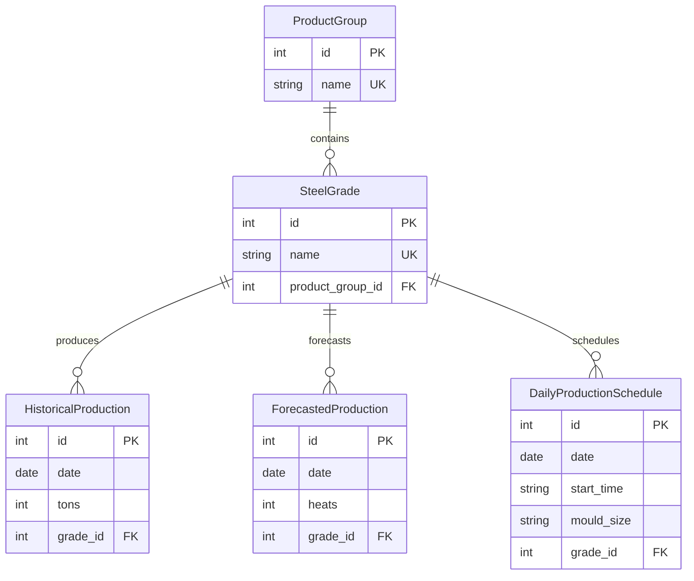

# FDM-CHALLENGE

In this repository a simple API and database schema are implemented for a steel plant's production plans.

## Repository Structure

```
FDM-CHALLENGE/
│
├── app/                     # Main application code
│   ├── __init__.py
│   ├── main.py              # FastAPI app entry point
│   ├── crud.py              # Database operations
│   ├── database.py          # Database connection setup
│   │         
│   └── models/              # Data models
│   │   ├── pydantic.py      # API request/response models
│   │   └── schema.py        # SQLAlchemy database models
│   │             
│   └── api/                 # API routes
│       ├── __init__.py
│       └── routes.py        # Endpoint definitions
│
├── data/                    # Sample data files
│   ├── daily_charge_schedule.xlsx
│   ├── product_groups_monthly.xlsx
│   ├── steel_grade_production.xlsx
│   └── /processed           # Processed data output
│
├── tests/                   # Unit tests
│   ├── __init__.py
│   └── test_api.py          # API endpoint tests
│
├── utility/                 # Helper functions
│   ├── preprocess.py        # Data preprocessing
│   └── linear_fit.py        # Forecasting logic
│
├── .github/workflows        # CI/CD automation
├── docker-compose.yml       # Container orchestration
├── Dockerfile               # Container build instructions
├── init.sql                 # Database schema setup
├── README.md                # Project documentation
├── forecast_logic.ipynb     # Linear fits plots
└── requirements.txt         # Python dependencies
```

## Project Highlights

### **Production-Ready Steel Plant API**
- **FastAPI + PostgreSQL**: Modern, high-performance API with robust database integration
- **Dockerized Deployment**: One-command setup with `docker-compose up --build`
- **Interactive Documentation**: Auto-generated OpenAPI docs at `/docs` for easy API exploration

### **Forecasting Engine**
- **Linear Regression Model**: Perfect correlation for group production predictions, scalable implementation and uncertainty discussion
- **Real-Time Predictions**: RESTful endpoint for generating forecasts for any month for which there is a prediction

### **Robust Data Processing Pipeline**
- **Multi-Format Data Ingestion**: Seamlessly processes non-tabular data and Excel (.xlsx, .xls) and CSV files
- **Data Validation**: Pydantic models ensure data integrity throughout the pipeline

### **API Design**
- **Modular Design**
- **Comprehensive CRUD Operations**
- **Scalable Schema**

### **Quality Assurance**
- **Automated Testing**: pytest-based unittest suite
- **CI/CD Pipeline**: GitHub Actions ensuring code quality with Black formatting

## Forecasting logic

The forecasting endpoint, runs a linear fit based on historical data relating x: production per quality group (short tons) and y: number of heats forecasted for quality group. For the data provided the linear fit coefficients ($A_{fit}$ and $B_{fit}$) were obtained with correlation coefficient $R \approx 1$.

<p>
P<sub>group</sub> = (A<sub>fit</sub> × X<sub>group forecast</sub> + B<sub>fit</sub>)</sub>
</p>

- **interpretability**: results for a linear regression are easy to communicate to client increasing their trust
- **$R \approx 1$**: plotted in ```forecast_logic.ipynb```

By multiplying the total number predicted heats for the quality group, $P_{group}$, by expected percetange of each Grade in the Group, $G_{Grade \% average}$, I can return forecast data in a format ScrapCheft accepts.

<p>
P<sub>grade</sub> = P<sub>group</sub> ×  G<sub>Grade % average</sub>
</p>

In ```forecast_logic.ipynb``` for each Grade the uncertainty (| mean - max deviation|) is calculated. This value can be quite high and is important to understand the strenght of the predictions for each Grade which varies significantly.


## Running the API

### Using Docker (Recommended)

The easiest way to run the project is using Docker, which automatically sets up both the application and PostgreSQL database. Assuming docker and docker compose have been installed on your system, the project can be set up with a single line:

```bash
docker-compose up --build
```

### Locally (Harder set up)

#### Install dependencies
1) The recommendable way to install the dependencies is using **uv**:

```
pip install uv
uv pip install -r requirements.txt
```

2) It is also possible to use virtual environment **venv**:

```
python -m venv fdm-challenge
source fdm-challenge/bin/activate
```

#### Database commands

When running locally since we are not using docker we need to install postgres:
```
sudo apt install postgresql postgresql-contrib
```
Then open the PostgreSQL interactive shell (psql): ```sudo -u postgres psql``` and create the database and users:

```
CREATE DATABASE steel_db;
CREATE USER steel WITH PASSWORD 'steel';
GRANT ALL PRIVILEGES ON DATABASE steel_db TO steel;
\q
```

Next, intialize the tables and grant permissions:
```
sudo -u postgres psql -d steel_db -f init.sql
```

You can check the tables were creating by running in psql:
```
SELECT table_name FROM information_schema.tables 
WHERE table_schema = 'public';
```

The API can be reached with:
```
python -m uvicorn app.main:app --reload --host 0.0.0.0 --port 8000
```

## Database Schema

The database schema is designed to model a steel plant's production workflow with the following entities:

### **Tables Overview**

```sql
-- Core entities
ProductGroup (id, name)
SteelGrade (id, name, product_group_id)

-- Production data: corresponding to data files
HistoricalProduction (id, date, tons, grade_id)
ForecastedProduction (id, date, heats, grade_id)
DailyProductionSchedule (id, date, start_time, mould_size, grade_id)
```

### **Entity Relationship Diagram**



**Relationship Legend:**
- `||--o{` = One-to-Many relationship
- `||--||` = One-to-One relationship  
- `}o--o{` = Many-to-Many relationship

### **Data Flow**

1. **Excel Data Ingestion**: Raw data from Excel files is processed and stored
2. **Historical Analysis**: Historical production data is analyzed using linear regression
3. **Forecasting**: Predictions are generated and stored in ForecastedProduction
4. **Scheduling**: Daily schedules are created based on forecasts and requirements

## Getting Started

1. **Start the application:**
   - If using docker run the following line but if running locally follow the instructions above.
   ```bash
   docker-compose up --build
   ```

2. **Access the API:**
   - **Interactive Docs**: http://localhost:8000/docs
   - **API Root**: http://localhost:8000

3. **Upload data to populate the database:**
   - Use the interactive docs at `/docs` to upload your Excel/CSV files:
   - **Product Groups**: Upload `product_groups_monthly.xlsx` via `/upload/product-groups`
   - **Historical Production**: Upload `steel_grade_production.xlsx` via `/upload/production-history`  
   - **Daily Schedule**: Upload `daily_charge_schedule.xlsx` via `/upload/daily-schedule`

4. **Test the endpoints:**
   - View product groups: `GET /product-groups`
   - View steel grades: `GET /steel-grades`
   - Generate forecasts: `POST /forecast`
   - Use ```http://localhost:8000/docs``` or alternatively curl e.g. ```curl -X GET "http://localhost:8000/"```

### **API Endpoints**

| Method | Endpoint | Description |
|--------|----------|-------------|
| GET | `/` | API information and available endpoints |
| GET | `/health` | Health check endpoint for monitoring |
| GET | `/docs` | Interactive API documentation |
| POST | `/forecast` | Generate production forecasts using linear regression |
| POST | `/upload/production-history` | Upload historical production data |
| POST | `/upload/product-groups` | Upload product groups and steel grades |
| POST | `/upload/daily-schedule` | Upload daily production schedules |
| GET | `/product-groups` | Get all product groups |
| GET | `/steel-grades` | Get all steel grades with pagination |
| GET | `/production-summary/{grade_id}` | Get production summary for specific grade |

## Unit Tests

The project includes a test suite to ensure API reliability. The tests validate core endpoints and error handling. The tests use FastAPI's TestClient for isolated testing without affecting production data. They can be run with:

```bash
pytest tests/
```
